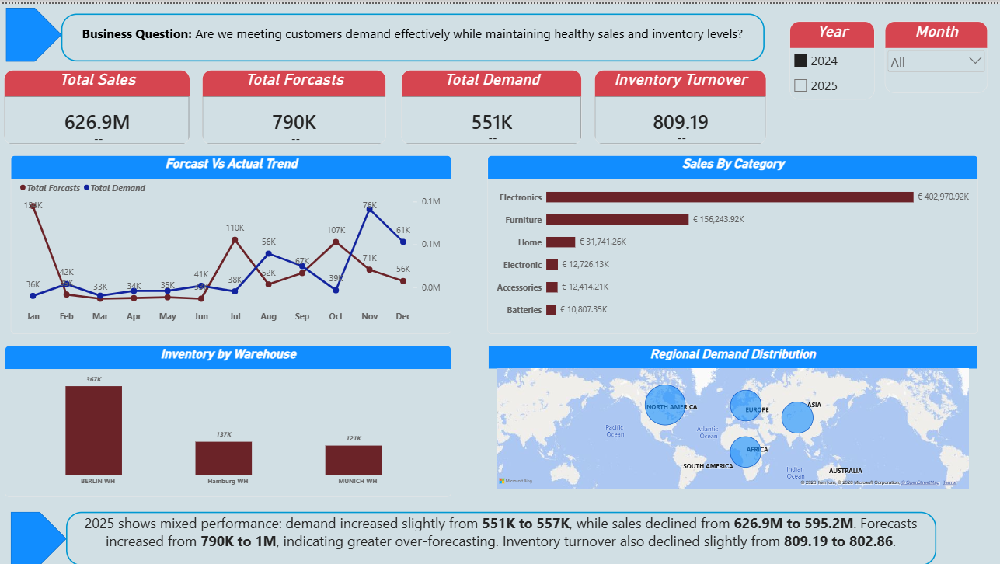
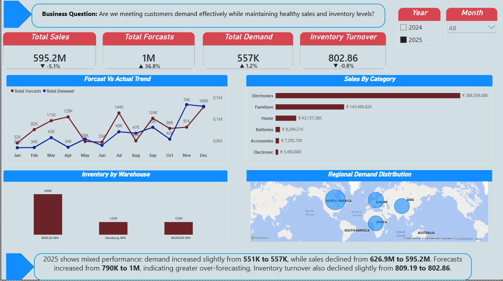
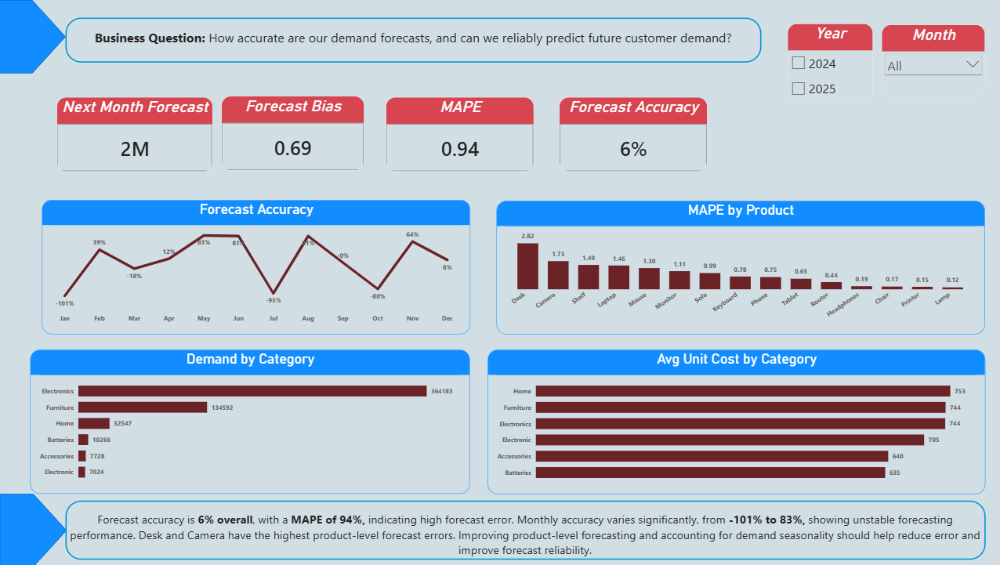
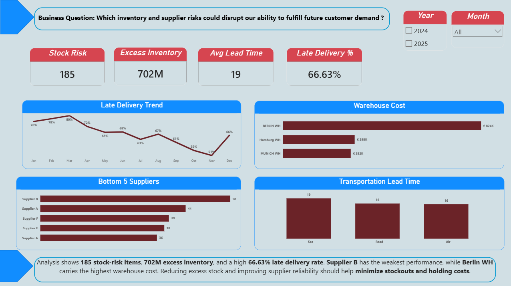

# Power BI Supply Chain Analytics

## Project Overview
An interactive Power BI dashboard designed to analyze **sales, customer demand, forecasting accuracy, inventory, and supplier performance**.

## Business Questions
- Are we meeting customer demand while maintaining healthy sales and inventory levels?
- How accurate are our demand forecasts?
- Which inventory and supplier risks could disrupt future customer demand?

## Dashboard Pages

### 1. Sales & Supply Chain Overview
Analyzes **sales, demand, forecasts, inventory turnover, regional demand, and warehouse inventory**.

### 2. Demand Forecasting
Evaluates forecasting performance using **Forecast Accuracy, MAPE, Forecast Bias, and demand trends**.

### 3. Inventory & Supplier Risk
Identifies **stock-risk items, excess inventory, late deliveries, supplier performance, and warehouse costs**.

## Tools & Skills
**Power BI | Power Query | DAX | Data Modeling | Data Visualization | Supply Chain Analytics**

## Dashboard Preview

### Sales & Supply Chain Overview — 2024

### Sales & Supply Chain Overview — 2025

### Demand Forecasting

### Inventory & Supplier Risk

## Key Insights

- **Sales declined from 626.9M to 595.2M** in 2025, while demand increased slightly from **551K to 557K**.
- Forecasts increased from **790K to 1M**, indicating significant **over-forecasting**.
- Overall **Forecast Accuracy was 6%**, with **94% MAPE**, highlighting substantial forecast error.
- Supply chain analysis identified **185 stock-risk items**, **702M excess inventory**, and a **66.63% late delivery rate**.
- **Supplier B** showed the weakest supplier performance, while **Berlin WH** carried the highest warehouse cost.

## About This Project

This portfolio project demonstrates the use of **Power BI, Power Query, DAX, data modeling, and supply chain analytics** to transform operational data into actionable business insights.

> **Note:** This project is intended for portfolio and demonstration purposes.
